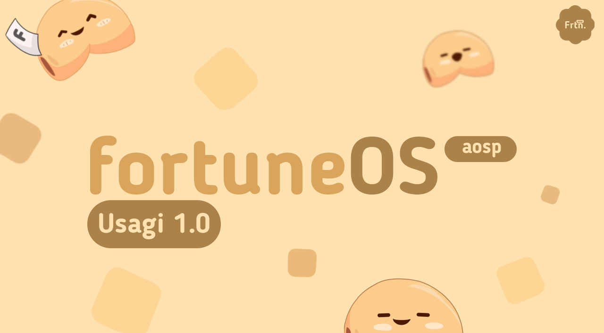

Hello, this month of July we want to present FortuneOS-AOSP. FortuneOS is an After-Market Android Platform based on LineageOS with the July security patch with QPR3 bundled with the tag `android-14.0.0_r53`



## Source Changelogs

```
- LineageOS as Based
- July Security Patch | android-14.0.0_r53
- Add support FaceUnlock
- Add monet customization
- Add ability to toggle bluetooth battery level
- Add statusbar brightness control
- Add quick settings brightness slider customizations
- Add icon shapes, icon packs and font styles
- Add signal and wifi icon style theming
- Add QS footer data usage
- Allow using 4G icon instead LTE
- Add Option to Display Data Disabled Indicator Icon
- Add Less boring heads up option
- Add window ignore secure feature
- Add power menu option
- Add statusbar quick pull down
- Add status bar clock customization
- Add status bar clock background chip
- Add status bar battery bar
- Add status bar network traffic customization
- Add battery style customization
- Allow disabling ripple effect on unlock
- Hide power menu on secure lock screen
- Spoof PixelPropsUtils
- Redesign settings UI with xdroidOSS styles
- Introduct our Bootanimation
- ETC
```
Stay tuned for further updates and device-specific changelogs as the update rolls out for supported devices.

## Official Support Devices.

```
- Redmi Note 12 4G (topaz/tapas)
- Poco X6 / Redmi Note 13 Pro 5G (garnet)
- Xiaomi 12 Lite (taoyao)
```

Thanks for being part of FortuneOS.

The FortuneOS Team